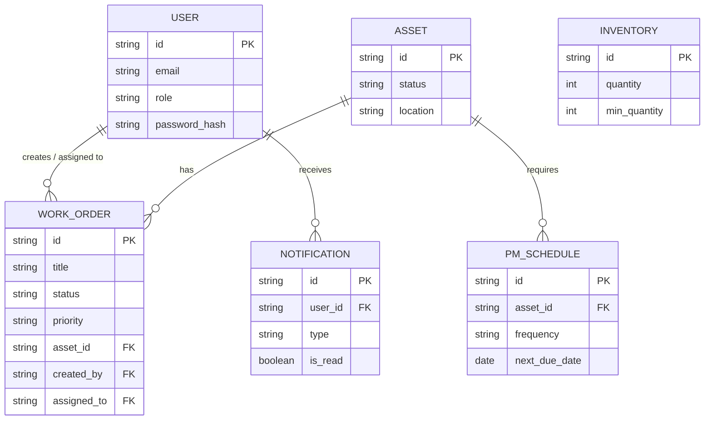
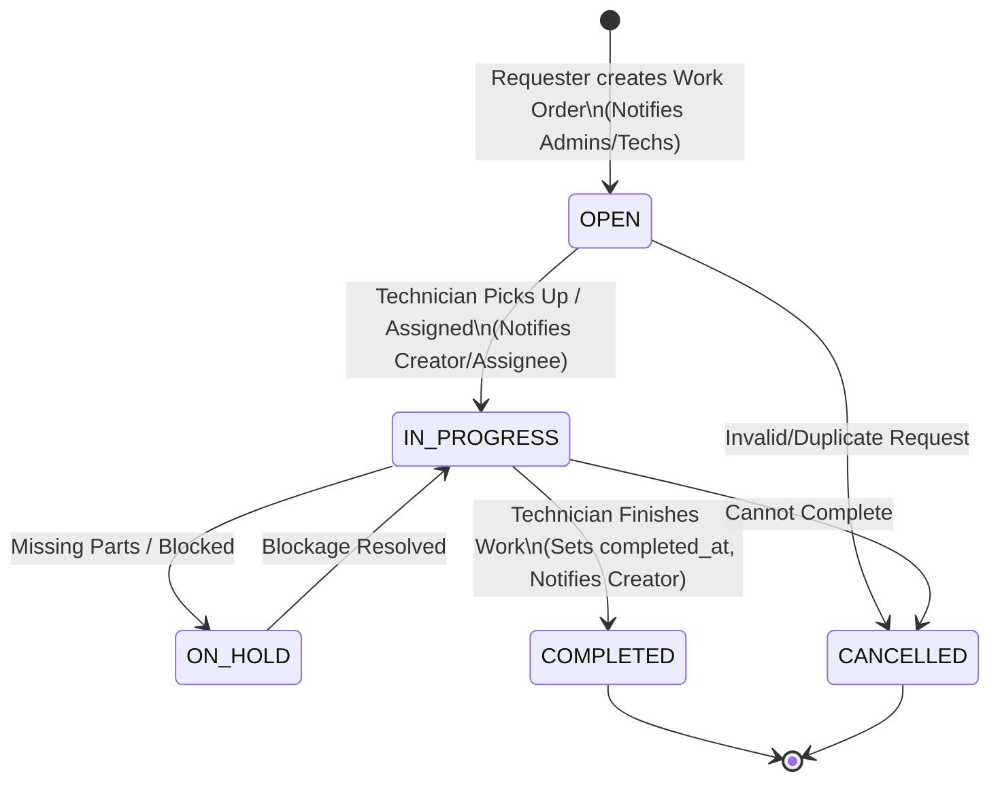
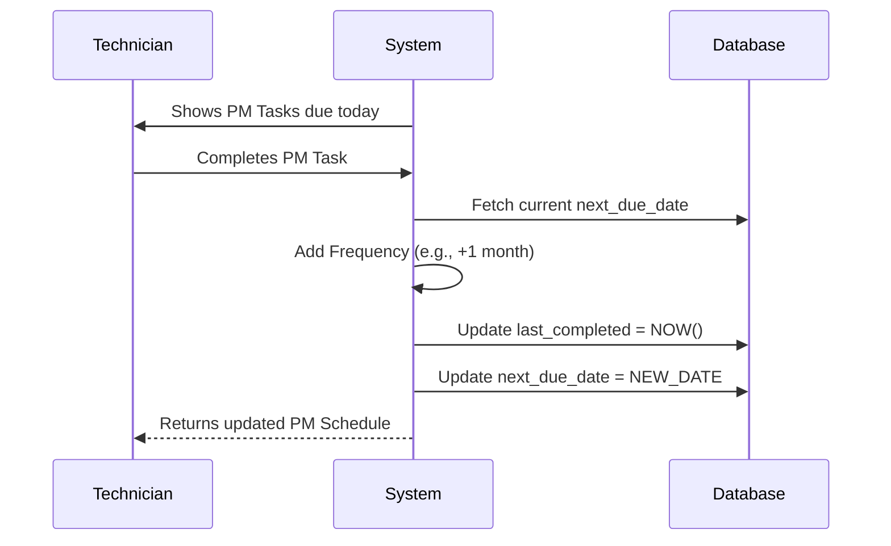
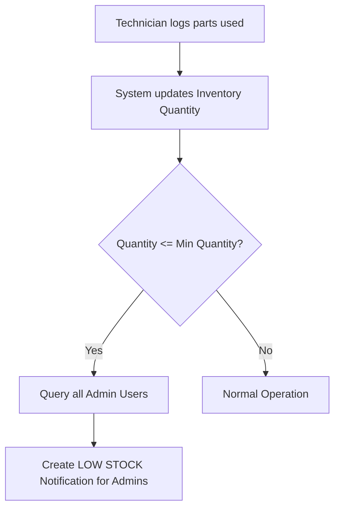

# Spartans CMMS - Business Logic & Architecture

## 1. System Overview
Spartans CMMS (Computerized Maintenance Management System) is an industrial-grade facility management application designed to handle Work Orders, Assets, Preventive Maintenance, and Inventory. 
The system features a FastAPI backend with MongoDB, and a React frontend utilizing Tailwind CSS and Shadcn/UI.

---

## 2. Core Entities & Business Rules

### 2.1 Users & Role-Based Access Control (RBAC)
The system enforces strict access control across three user personas:
- **Admin**: Full system access. Can view/manage all users, assets, work orders, inventory, and system settings.
- **Technician**: Operational access. Can view and update work orders assigned to them or generally, manage asset statuses, and complete Preventive Maintenance (PM) tasks.
- **Requester**: Limited access. Can only create work orders and view the status of their own submitted work orders. Cannot manage assets, inventory, or PM schedules.

**Authentication Rules:**
- JWT-based authentication (HS256 algorithm, 24-hour expiration).
- Passwords are hashed using bcrypt.

### 2.2 Work Order Management
The core ticketing system for tracking maintenance requests and tasks.
**Properties:** `Title`, `Description`, `Priority` (Low, Medium, High, Critical), `Status`, `Asset (Optional)`, `Location`, `Due Date`, `Creator`, `Assignee`, `Notes`.

**Business Rules:**
- **Creation**: Requesters can create work orders. Upon creation, Admins and Technicians receive an automatic notification.
- **Status Lifecycle**: `OPEN` → `IN_PROGRESS` | `ON_HOLD` → `COMPLETED` | `CANCELLED`.
- **Completion**: When marked `COMPLETED`, the system records the `completed_at` timestamp.
- **Visibility**: Requesters can only see work orders they created. Technicians and Admins can see all work orders (or filter by assignment).
- **Updates**: Requesters cannot update work orders. System notifies the creator when the status changes, and notifies an assignee when they are assigned a work order.

### 2.3 Asset Management
Tracks all equipment and facilities requiring maintenance.
**Properties:** `Name`, `Description`, `Category`, `Location`, `Serial Number`, `Manufacturer`, `Purchase Date`, `Warranty Expiry`, `Status`.

**Business Rules:**
- **Status Types**: `OPERATIONAL`, `MAINTENANCE`, `OUT_OF_SERVICE`, `RETIRED`.
- **Relationship**: Assets are linked to Work Orders (creating a maintenance history) and PM Schedules.
- **Access**: Only Admins and Technicians can create/update/delete assets.

### 2.4 Preventive Maintenance (PM) Schedules
Automates the creation of recurring maintenance tasks to prevent asset failure.
**Properties:** `Title`, `Description`, `Asset ID`, `Frequency`, `Next Due Date`, `Assignee`, `Checklist`.

**Business Rules:**
- **Frequencies**: `DAILY`, `WEEKLY`, `BIWEEKLY`, `MONTHLY`, `QUARTERLY`, `YEARLY`.
- **Completion Logic**: When a PM schedule is marked as complete, the system automatically recalculates the `next_due_date` by adding the frequency interval to the *current due date* (not the completion date), and records `last_completed`.

### 2.5 Inventory & Spare Parts
Tracks parts and consumables used in maintenance.
**Properties:** `Name`, `Category`, `SKU`, `Quantity`, `Min Quantity (Threshold)`, `Location`, `Unit Cost`.

**Business Rules:**
- **Stock Depletion**: Updates to inventory trigger a threshold check.
- **Low Stock Alerts**: If `Quantity` drops to or below `Min Quantity`, the system automatically generates an `INVENTORY` notification for all Admins.

### 2.6 Notifications System
In-app alerts keeping users informed of critical events.
- **Triggers**: 
  - Work Order Created (Sent to Admins/Technicians).
  - Work Order Assigned (Sent to Assignee).
  - Work Order Status Changed (Sent to Creator).
  - Inventory Low Stock (Sent to Admins).

---

## 3. System Diagrams

### 3.1 Entity Relationship Diagram (ERD)

### 3.2 Work Order Lifecycle & Event Flow

### 3.3 Preventive Maintenance Automation Flow

### 3.4 Inventory Alert Workflow

---

## 4. Reporting & Analytics
The dashboard and analytical engine aggregate live metrics across the facility:
1. **Work Order Stats**: Counts by status (`Open`, `In Progress`, `Completed`) and priority (`Critical` pending).
2. **Asset Health**: Ratio of `Operational` vs `Maintenance` assets.
3. **Inventory Risks**: Aggregate count of items under minimum threshold.
4. **Maintenance Efficacy**: Calculation of overall completion rate based on date-filtered reports.
